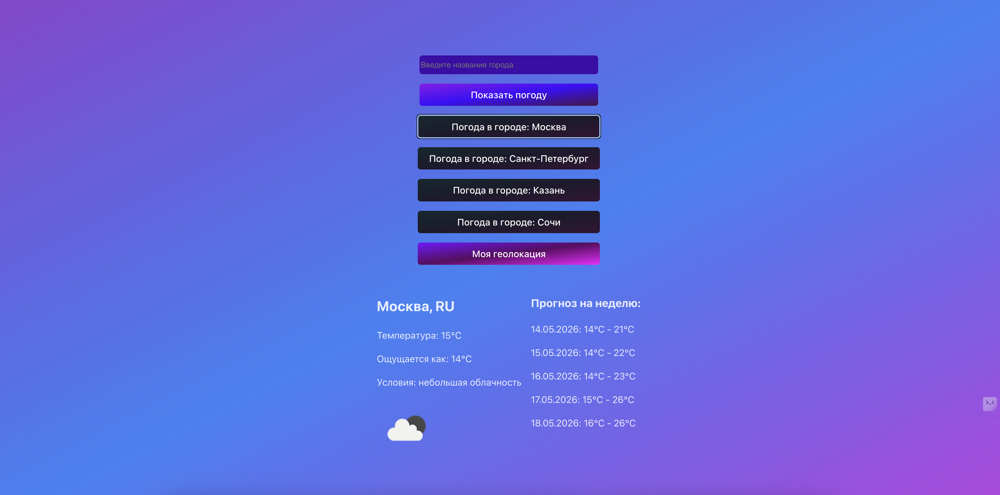

# Weather App

A modern fullstack weather application built with React, Vite, Express, Prisma, and SQLite.

The application allows users to search weather by city name, get weather using geolocation, view a weekly forecast, and store search history in a database.

---

# Preview

Then it will be displayed automatically in README:



---

# Using
### 1 We enter the desired city or choose from the suggested ones, we get weather data and the history of early queries by city.


### 2 After clicking the "Clear history" button, we get an empty database and an empty list is displayed visually in the application.


# Features

* Search weather by city name
* Get weather using geolocation
* Weekly weather forecast
* Search history
* Clear search history
* SQLite database integration
* REST API backend
* Error handling
* Loading states
* Environment variables support
* Responsive UI
* CSS Modules
* Custom React hooks

---

# Tech Stack

## Frontend

* React
* Vite
* CSS Modules
* Custom Hooks

## Backend

* Node.js
* Express.js
* Prisma ORM
* SQLite

## API

* OpenWeather API

---

# Project Structure

```bash
src/
├── assets/
│   └── citys.js
├── components/
│   ├── History.jsx
│   └── Temperature.jsx
├── hooks/
│   ├── useFetch.js
│   └── useWeather.js
├── services/
│   └── weatherApi.js
├── styles/
│   ├── App.css
│   ├── App.module.css
│   ├── History.module.css
│   ├── Temperature.module.css
│   └── index.css
├── App.jsx
└── main.jsx

server/
├── prisma/
│   ├── migrations/
│   └── schema.prisma
├── index.js
├── .env
└── package.json
```

---

# Installation

## 1. Clone repository

```bash
git clone <your-repository-url>
cd weather-app
```

---

# Frontend Setup

## Install dependencies

```bash
npm install
```

## Start frontend

```bash
npm run dev
```

Frontend will run on:

```bash
http://localhost:5173
```

---

# Backend Setup

## Open server directory

```bash
cd server
```

## Install dependencies

```bash
npm install
```

## Install Prisma

```bash
npm install prisma@5 @prisma/client@5
```

---

# Environment Variables

## Frontend `.env`

Create `.env` in the project root:

```env
VITE_API_KEY=your_openweather_api_key
```

---

## Backend `.env`

Create `.env` inside `server/`:

```env
DATABASE_URL="file:./dev.db"
```

---

# Prisma Setup

## Initialize Prisma

```bash
npx prisma init
```

## Run migrations

```bash
npx prisma migrate dev --name init
```

## Generate Prisma Client

```bash
npx prisma generate
```

---

# Run Backend

```bash
node index.js
```

Backend runs on:

```bash
http://localhost:3001
```

---

# API Endpoints

## Get Search History

```http
GET /history
```

---

## Save Search History

```http
POST /history
```

Request body:

```json
{
  "city": "Moscow"
}
```

---

## Clear Search History

```http
DELETE /history
```

---

# Database Schema

```prisma
generator client {
  provider = "prisma-client-js"
}

datasource db {
  provider = "sqlite"
  url      = env("DATABASE_URL")
}

model SearchHistory {
  id        Int      @id @default(autoincrement())
  city      String
  createdAt DateTime @default(now())
}
```

---

# Application Architecture

```text
React Frontend
       ↓
Custom Hooks
       ↓
Weather API Service
       ↓
Express Backend
       ↓
Prisma ORM
       ↓
SQLite Database
```

---

# Main Components

## App.jsx

Main application component.

Responsibilities:

* UI rendering
* Search handling
* State management
* Weather display
* Forecast display

---

## useWeather.js

Custom hook for:

* weather fetching
* loading states
* error handling
* forecast fetching
* geolocation weather
* backend integration

---

## History.jsx

Displays search history.

Features:

* fetch history
* render history list
* clear history
* auto refresh after search

---

## weatherApi.js

Handles OpenWeather API requests.

---

# Search History Flow

```text
User Search
    ↓
searchWeather()
    ↓
OpenWeather API
    ↓
Weather Data
    ↓
POST /history
    ↓
Express Backend
    ↓
Prisma ORM
    ↓
SQLite Database
    ↓
History Component Update
```

---

# Error Handling

The application handles:

* invalid city names
* API errors
* network errors
* geolocation permission errors
* backend request errors

---

# Loading States

The app uses loading states for:

* weather requests
* forecast requests
* history loading
* geolocation requests

---

# Future Improvements

* Authentication
* Favorite cities
* PostgreSQL support
* Weather charts
* Docker support
* Deployment
* Unit tests
* React Query integration

---

# Learning Goals

This project demonstrates:

* React fundamentals
* Custom hooks
* API integration
* Fullstack architecture
* REST API development
* Database integration
* Prisma ORM usage
* State management
* Error handling
* Async JavaScript

---

# Author

Developed as a React practice project  by Vyacheslav R.
